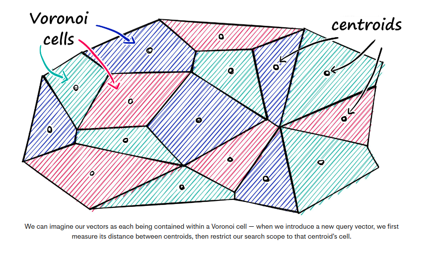
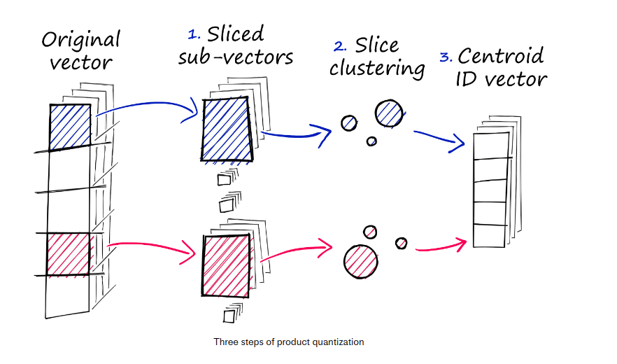

Source : [Faiss: the missng manual](https://www.pinecone.io/learn/series/faiss/faiss-tutorial/)

# installation

- `Faiss` comes with built-in GPU optimization for any CUDA enabled Linux machine 
- > conda install -c pytorch faiss-gpu
- > without GPU: conda install -c pytorch faiss-cpu
- > [without conda](https://github.com/facebookresearch/faiss/blob/main/INSTALL.md)

# Index

## IndexFlatL2

- measures the **Euclidean distance** (L2 distance) between our query and all the
given vectors in the DB
- Instantiates `IndexFlatL2` with the vector dimensionality (embedding size)
- > index = faiss.IndexFlatL2(d)
- **Some indexes need to be trained before using them so need to check** 
`index.is_trained`
- This index doesn't scale well and is computationally expensive (*exhaustive search*)

## Partitioning the index

- Faiss allows to partition the index into **Voronoi cells** to optimize the comparaisons


## IndexIVFFlat

- reduce the scope of the search by coparing only to the centroids
- we initialize `IndexFlatL2` but it will be just a **quantizer step** which we
feed into paritioning `IndexIVFFlat` index
```python
nlist = 50 # how many cells
quantizer = faiss.IndexFlatL2(d)
index = faiss.IndexIVFFlat(quantizer, d, nlist)
```
- becasuse there is **clustering**, need to train the index
- if approximate search gives suboptimal results, increase the `nprobe` attribute value.
It defines how many cells to search

## Vector reconstruction

- there is no direct mappring between the original vectors and their index position
due to the addition of the IVF step
- We first must create these dicrect mapping using `index.make_direct_map` 

## Quantization (IndexIVFPQ)

- Faiss can compress the vectors using *Product Qunatization*(PQ). It approximates
the distance/similarity calculation.
- There are 3 steps:
    1. Split the original vector into several subvectors
    2. For each set of subvectors, perform a clusterinng operation - creating multiple
    centroids for each sub-vector set.
    3. In our vector of sub-vectors, we replace each sub-vector with the ID of it's
    nearest set-specific centroid

]

```python
m = 8  # number of centroid IDs in final compressed vectors
bits = 8 # number of bits in each centroid

quantizer = faiss.IndexFlatL2(d)  # we keep the same L2 distance flat index
index = faiss.IndexIVFPQ(quantizer, d, nlist, m, bits) 
```


# Functions

- `index.add` : add all the vectors from the DB to the index
- `index.ntotal`: know how many vectors in the index (return **False** if not trained yet)
- `index.is_trained` : if the index needs to be trained before using it
- `D,I = index.search(xq,k)` :search for the top-k vectors closed to the query 
- `index.train(embeddings)`: to train the index on the embedding vectors from the DB
- `index.nprobe = <int>` : defined in how many cells to search 
- `index.make_direct_map()` : create direct mapping between before and after IVF
- `index.reconstruct(<vector_idx>)` : retrieve the original vector