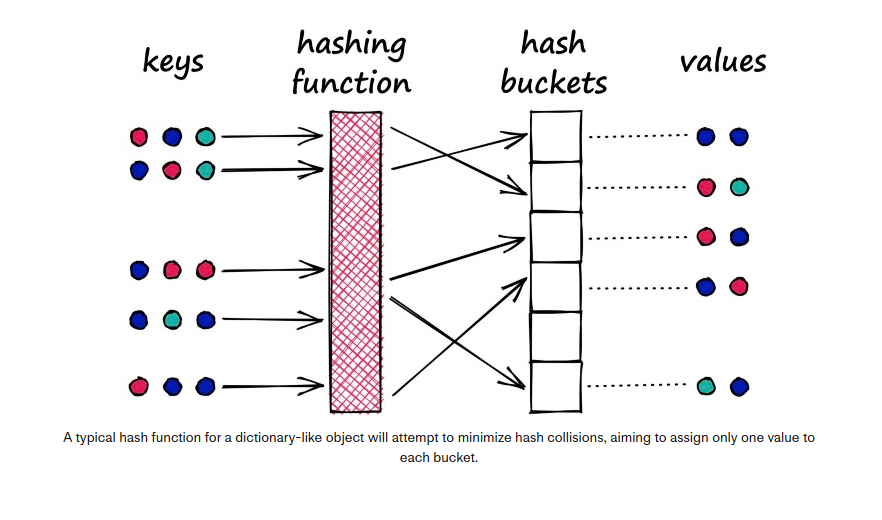
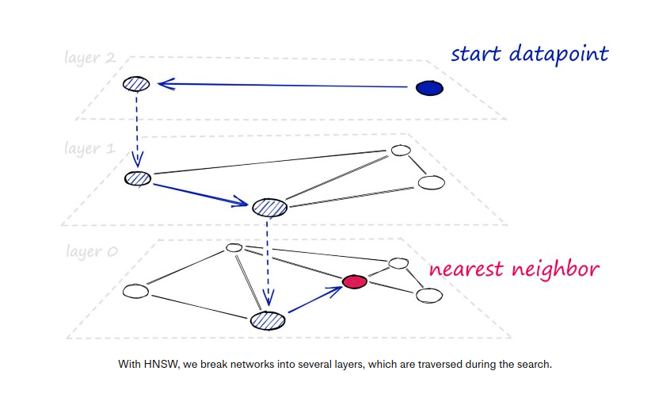
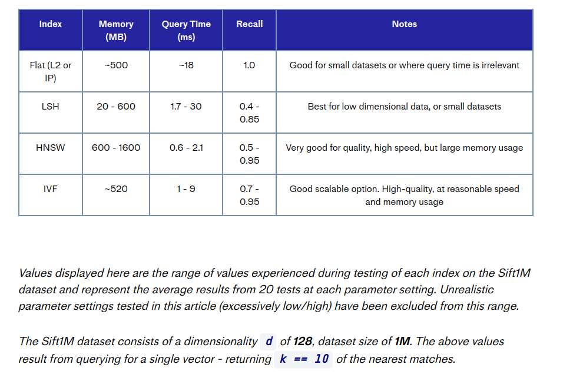

[source](https://www.pinecone.io/learn/series/faiss/vector-indexes/)

# Indexes for Efficient Search

- many indexes an be mixed to produce a better and faster similarity search
- There exists different types of indexes

## Flat indexe: IndexFlat<L2/IP>

- 'flat' because we do not modify the original vector.
- most accurate but slow
- 2 types of flat indexes: `IndexFlatL2` and `IndexFlatIP`
- `IndexFlatIP` can be slightly faster
- **no training needed**
  
## Balancing search time

- How can we reduce the search time ?
  1. Reduce Vector size: dimensionality reduction or precision of bits 
  representing values.
  2. Reduce search scope: clustering or organizing vectors into tree structures 
  and restricting our search to closest clusters

- it's no longer exhaustive nearest-neighbors but **approximate nearest neighbors (ANN)**
search

## Locality Sensitive Hashing (LSH) : IndexLSH

- groups the vectors into buckets by processing each vector through an hash function
that maximizes hashing collisions.
- example of hashing a dictionary in Python
  
- A Python dictionary is an example of a hash table using a typical hashing function
that **minimizes** hashing collision - where 2 different objects (keys) produce the 
same hash.
- for LSH, we want to **maximize** the collisions. because we want to group similar 
objects. So when we have a query, we find the closest group

    ### implementation in FAISS

    ```python
    nbits = d*4  # resolution of bucketed vectors
    # initialize index and add vectors
    index = faiss.IndexLSH(d, nbits)
    index.add(wb)
    # and search
    D, I = index.search(xq, k)
    ```

    the `nbits` arguments refers to the 'resolution' of the hashed vectors. when 
    high we have a greater accuracy but slower speed.

- higly sensitive to "the curse of dimensionality"
- best suited to small dataset and low-dim vectors(128 is large...) 

## Hierarchical Navigable Small World Graphs (HNSWG) : IndexHNSWFlat

- HNSW-based ANNS consistently top out as the highest performing indexes
- further adaptation of navigable small world (NSW) graphs - where an NSW graph
is a graph structure containing vertices connected by edges to their nearest neighbors.
- HNSWGs are built of NSWGs and breaking them into multiple layers. with each incremental layer eliminating intermediate connections between vertices
  

  ### implementation in FAISS
  ```python
  # set HNSW index parameters
    M = 64  # number of connections each vertex will have
    ef_search = 32  # depth of layers explored during search
    ef_construction = 64  # depth of layers explored during index construction

    # initialize index (d == 128)
    index = faiss.IndexHNSWFlat(d, M)
    # set efConstruction and efSearch parameters
    index.hnsw.efConstruction = ef_construction
    index.hnsw.efSearch = ef_search
    # add data to index
    index.add(wb)

    # search as usual
    D, I = index.search(wb, k)
    ```

    important parameters:
    - `M` - number of nearest neighbors each vertex will connect to
    - `efSearch` - how many entry points will be explored between layers during the search
    - `efConstruction` - how many entry points will be explored when building the index
    each param can be increased to improve the accuracy

- HNSWGs take up a significant amount of memory. it depends on the `M` param

## Inverted File Index (IVF) : IndexIVFFlat

- The IVF index consists of search scope reduction through clustering.
- high search-quality and reasonable search-speed.
- Use **Voronoi diagrams** : highly-dimensional vectors placed into a 2D space. Then place a few additional points in our 2D space, which will become our 'cluster' (Voronoi cells) **centroids**.
- each data point is attributed to a cell and its respective centroid.
- *edge problem*: when a query lands in one cell but the nearest neighbor is in another cell
- with the `nprobe` param we can increase the number of cells checked
  
  ### IVF implementation in FAISS
  ```python
    nlist = 128  # number of cells/clusters to partition data into

    quantizer = faiss.IndexFlatIP(d)  # how the vectors will be stored/compared
    index = faiss.IndexIVFFlat(quantizer, d, nlist)
    index.train(data)  # we must train the index to cluster into cells
    index.add(data)

    index.nprobe = 8  # set how many of nearest cells to search
    D, I = index.search(xq, k)

  ```
  parameters:
  - `nprobe` number of cells to search  - increase to prioritize the search-quality
  - `nlist` number of cells to create - increase to prioritize search-speed

## Summary

